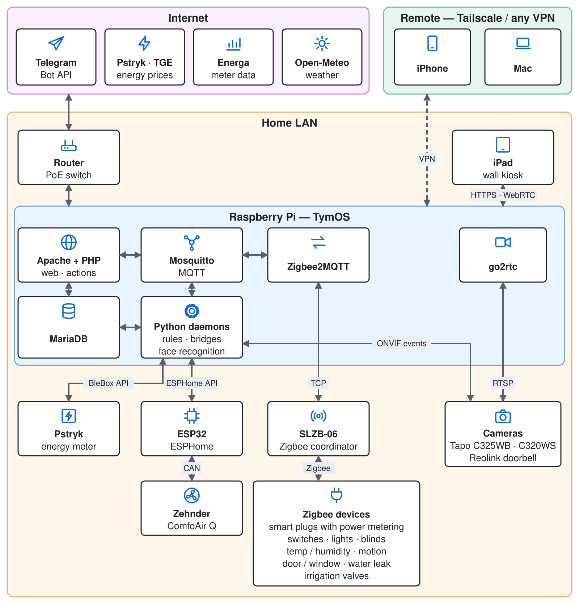

# TymOS

DIY home automation running on a Raspberry Pi — Zigbee devices, heating and hot-water buffer, ventilation, cameras, alarm and dynamic energy prices, all in one lightweight PHP + Python stack.

TymOS is a personal project that runs a real house every day. It is shared as-is: as inspiration, a source of working examples, or a base for your own system.

> Code comments and UI texts are in Polish.


*Wall-mounted kiosk panel: cameras, doorbell, weather, ventilation flow, dynamic energy prices, heating, garden.*

## What it does

- **Zigbee** — all devices through Zigbee2MQTT; readings stored in MariaDB, availability monitoring and automatic network recovery
- **Rules engine** — actions triggered by sensor changes, schedules (cron) or scripts, with conditions and fail-safe behaviour when a reading is missing or stale
- **Heating & hot water** — a buffer tank heated with electric heaters at the cheapest hours (dynamic prices), pellet boiler cost tracking, underfloor heating
- **Ventilation** — Zehnder ComfoAir Q heat-recovery unit controlled via ESPHome (fan speeds, bypass, away mode, night limits)
- **Energy** — dynamic electricity prices (Pstryk API, TGE), meter data import (Energa Operator), per-phase power, voltage, cost per appliance cycle
- **Cameras & doorbell** — go2rtc (WebRTC / HLS), ONVIF events, vehicle and person detection, face recognition (OpenCV YuNet + SFace)
- **Alarm** — arm levels (off / night / away), Telegram notifications with camera snapshots, presence simulation
- **Garden** — irrigation sections, frost protection for the pump, pool filtration
- **Blinds & lights** — sun-position-based blind control, motion lights, multi-click switches
- **Notifications** — Telegram (normal + alert channel, night quiet hours) and voice announcements on a wall tablet
- **Kiosk UI** — fast single-page panel for a wall-mounted iPad, plus an admin panel (devices, actions, helpers, logs, sounds, system)

## Stack

| Layer | Technology |
|---|---|
| Hardware | Raspberry Pi, SMLIGHT SLZB-06 Zigbee coordinator (PoE) |
| Messaging | Mosquitto (MQTT), Zigbee2MQTT |
| Backend | PHP 8 (web + actions), Python 3 (daemons and bridges) |
| Database | MariaDB |
| Web | Apache 2, jQuery |
| Video | go2rtc |
| Integrations | ESPHome, BleBox, ONVIF, Telegram Bot API, Open-Meteo, Pstryk |

## Architecture



## Repository layout

```
actions/    PHP scripts run by the rules engine or cron (automations, imports, watchdogs)
daemons/    Python services: MQTT listener + rules engine, ESPHome / BleBox / ONVIF bridges, face recognition
tymos/      Web app: kiosk panel, admin panel, API, config
etc/        System config: Apache, go2rtc, ESPHome (*.tpl templates), systemd units, MariaDB
scripts/    Backup, restore, render_etc.php
utils/      Tools: Zigbee network scan, sensor reporting setup, face enrollment, keepalives
tests/      Browser tests for UI cards
```

## Configuration

All private data — passwords, tokens, IP addresses, location — lives in **one file**, which is not in the repository:

```bash
cp tymos/config.example.inc.php tymos/config.inc.php
# edit tymos/config.inc.php
```

- PHP code reads it directly (`define()` constants).
- Python daemons read it via `daemons/config.py`.
- Shell scripts read it via a small `cfg KEY` helper.
- System files (Apache vhost, go2rtc streams, ESPHome) are kept as `etc/**/*.tpl` templates with `{{KEY}}` placeholders. Generate the real files with:

```bash
php scripts/render_etc.php --check   # preview what would change
php scripts/render_etc.php           # write the files
```

The generated files are git-ignored.

## Database

`schema.sql` — MariaDB structure without data (core tables + one example of the per-device `device<ID>` / `stat<ID>` tables, which the code creates automatically).

## Use it with your AI agent

TymOS is built for one specific house and one specific setup. As it is, it will not fit everyone's needs — and that is fine. What it gives you is a large set of **working, battle-tested solutions**: scripts, automations, device bridges, UI cards and ideas. The intended way to use it is together with an AI coding agent (Claude Code or any other) that adapts it to *your* environment.

Paste this into your agent:

```
Study the project https://github.com/tymoteuszrogalewski/tymos
(README, schema.sql, tymos/config.example.inc.php, scripts/restore.sh, etc/).
Then help me install and adapt it on my server. Before installing anything, ask me about:
- the target server and directory,
- the web server (Apache / nginx) and PHP version,
- the database (MariaDB / MySQL): host, user, password, database name,
- MQTT broker and Zigbee coordinator,
- which features I actually want (Zigbee, cameras, energy prices, heating, alarm, Telegram...).
Install only what is needed, fill in tymos/config.inc.php with my values,
and adapt the code to my devices.
```

The agent can then install packages, create the database from `schema.sql`, prepare the config and services — step by step, with your approval.

## Installation

TymOS expects to live in `/opt/tymos` on a Debian / Raspberry Pi OS host. `scripts/restore.sh` documents the full setup (packages, services, cron) and is the best reference for now.

A step-by-step guide for a fresh install is planned.

## License

MIT — see [LICENSE](LICENSE).
